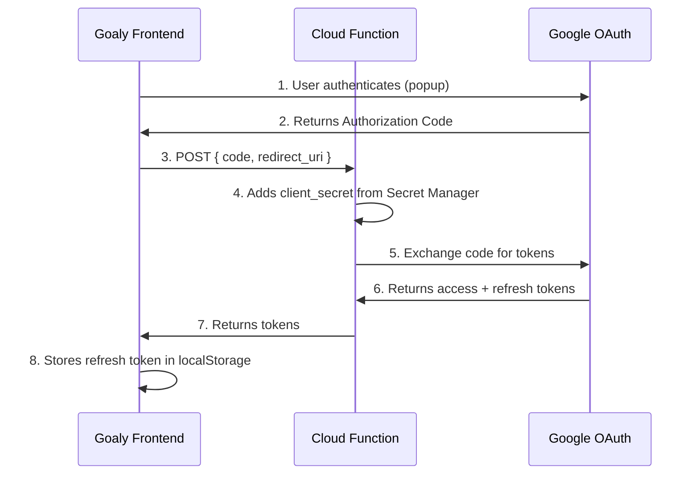

# Goaly OAuth Implementation & Deployment Guide

This document describes the OAuth 2.0 flow implemented in Goaly for Google Drive synchronization. The architecture uses serverless Google Cloud Functions for secure token exchange.

## 1. Architecture Overview

Goaly uses the **OAuth 2.0 Authorization Code Flow** with a serverless backend for secure token exchange.

### Components



### Token Storage
- **Access Token**: In-memory only (1 hour validity)
- **Refresh Token**: localStorage (`goaly_gdrive_refresh_token`)
- **Client Secret**: Google Cloud Secret Manager (never exposed to frontend)

## 2. Cloud Function

**Endpoint**: `https://us-central1-goaly-478316.cloudfunctions.net/exchangeToken`

### Functionality
The function handles two operations:
1. **Token Exchange**: Swap authorization code for tokens
2. **Token Refresh**: Use refresh token to get new access token

### Request: Token Exchange
```http
POST /exchangeToken
Content-Type: application/json

{
    "code": "4/0AX4XfWh...",
    "redirect_uri": "https://your-app-origin"
}
```

### Request: Token Refresh
```http
POST /exchangeToken
Content-Type: application/json

{
    "refresh_token": "1//0g..."
}
```

### Response
```json
{
    "access_token": "ya29.a0AfH6SM...",
    "refresh_token": "1//0g...",
    "expires_in": 3599,
    "token_type": "Bearer"
}
```

## 3. Frontend Integration

### Configuration
Add to `config.local.js`:
```javascript
window.GOOGLE_API_KEY = "your-api-key";
window.GOOGLE_CLIENT_ID = "your-client-id.apps.googleusercontent.com";
window.TOKEN_ENDPOINT = "https://us-central1-goaly-478316.cloudfunctions.net/exchangeToken";
```

### Authentication Flow
1. User clicks "Sign in with Google"
2. OAuth popup opens via Google Identity Services
3. Authorization code returned to app
4. App sends code to Cloud Function
5. Cloud Function exchanges for tokens (adding client_secret)
6. App stores refresh token in localStorage
7. Access token used for Google Drive API calls

### Token Refresh
When access token expires:
1. App retrieves refresh token from localStorage
2. Sends to Cloud Function with `{ refresh_token: ... }`
3. Receives new access token
4. Continues API operations

## 4. Deployment

### Prerequisites
- Google Cloud Project with Drive API enabled
- OAuth 2.0 credentials configured

### Deploy Cloud Function
```bash
cd functions

# Create secret (one-time)
echo -n "YOUR_CLIENT_SECRET" | gcloud secrets create GOOGLE_CLIENT_SECRET --data-file=-

# Grant access
gcloud secrets add-iam-policy-binding GOOGLE_CLIENT_SECRET \
    --role=roles/secretmanager.secretAccessor \
    --member=serviceAccount:YOUR_PROJECT_ID@appspot.gserviceaccount.com

# Deploy
gcloud functions deploy exchangeToken \
    --gen2 \
    --runtime=nodejs20 \
    --region=us-central1 \
    --trigger-http \
    --allow-unauthenticated \
    --set-env-vars=GOOGLE_CLIENT_ID=your-client-id \
    --set-secrets=GOOGLE_CLIENT_SECRET=GOOGLE_CLIENT_SECRET:latest
```

## 5. Security Considerations

| Aspect | Implementation |
|--------|---------------|
| Client Secret | Stored in Google Secret Manager |
| Refresh Token | localStorage (acceptable for this app type) |
| Access Token | Memory only, never persisted |
| CORS | Configured for frontend origin |
| Transport | HTTPS only |

## 6. Troubleshooting

### Token Exchange Fails
- Verify redirect_uri matches OAuth console settings
- Check authorization code hasn't expired (10 min validity)

### Token Refresh Fails
- User may have revoked access - prompt re-authentication
- Refresh token may be invalid - clear localStorage and re-authenticate
